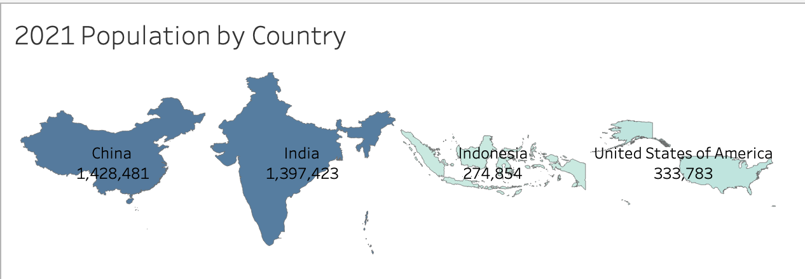
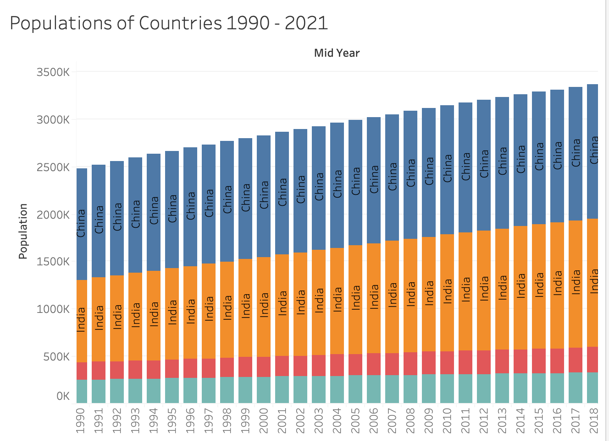

# Country_Population_Growth

## Selected Topic: Forecasting Population Growth in the United Nations' four largest countries (by population) (United States, China, Indonesia, and India)

## Reason why we selected this topic: 
There are varying opinions of whether the population of the world is sustainable from a resources perspective. Population has a unique impact the sustainability of our climate, education system, and economy. We seek to understand the population growth trends within the United Nations’ four largest countries (in terms of population): United States, China, Indonesia, and India. We will then use this data to make inferences about population viability.

## Description of Source Data: 
Our primary source of data is United Nations census data for the United States, China, Indonesia, and India. This includes total population statistics and growth percentages. (https://population.un.org/wup/DataQuery/)

## Questions we hope to answer with the data:
- Is the population in the United Nations' largest countries (in terms of population) growing or declining?
- Are we at a point where we should seek to accelerate or decline population expansion?
- Are certain countries more likely to have stronger population growth than others?
- What will the population of these countries look like in the next 5 years?

## Description of communication protocols
- Our team is mainly communicating via a Slack channel - during class sessions, we divide work and confirm each member's deliverables on this slack channel. We also discuss any barriers that need to be handled as a team
- We also have our Google slides to draft presentation ideas
(https://docs.google.com/presentation/d/1lzzH5QWJL6UF9R3eWyLcfaqSGRQeHIwNNbpT4gfCJ90/edit#slide=id.g13be2890723_0_6)
- Finally, we all have each other's emails to connect if there are any Slack issues

### Data Exploration phase
The training data was plotted to look for any seasonality or trends. An autocorrelation graph was created to determine how many times the data needed to be differenced. Using the differenced data, a partial autocorrelation plot and another autocorrelation plot were made to determine
values for the order of variables (p,q) in the arima model.

### Data Analysis Phase
An ARIMA model was used to analyze the time-series data and forecast future population values. The results of the model was
then used to forecast future results to compare against the test data. The real values and the predicted values were plotted to visualize the accuracy of the model.

## Provisional Database
Our team has created a provisional SQL database using PGAdmin.
There are two main tables:
- Countries: Each country name with a unique identifier

- Populations: UN population data

- Provisional Entity Relationship Diagram (ERD)

- The below connection string was used to connect our machine learning model to this database.

- We used an Inner Join to create a new table called countries_populations which has the country names and all population information:

See below for Inner Join logic:

See below for a select of all information within the countries_populations table:

## Provisional Machine Learning Model, Preliminary Feature Engineering, Benefits, and Drawbacks
Our team created a provision ML model to analyze the time-series data. An ARIMA (auto-regressive integrated moving average) was used to analyze the data and forecast population values. 

Benefits: The main advantage of ARIMA forecasting is that it requires data on the time series in question only. The focus on linear regression modeling lends to our main goal of population production.
Drawbacks: The main drawback of the Arima model is that it is computationally taxing. Longer projections can take time and mass computer power; however, this is not an issue with our current design as we only seek to predict 5 years into the future. The parameters of the model have to be manually defined, so its a trial and error process that is not always the most efficient.

## Training and Test Data Split
Our training data is mid-year population for all 4 countries from 1990-2020.
Our test data is 2021 mid-year population for all 4 countries. We also plan to predict 5 years into the future.

The model can be seen below

The forecasted population values and test values can be seen below

## Provisional Dashboard 
The dashboard is set to display initial analysis elements, accuracy graph from machine learning model, projected graph displaying results predicted by ML model, and interactive element displaying the growth of population recorded from 1990 to 2021. 

The visual elements to be displayed along with the technology are listed in detail below: 
 1. Global heatmap displaying countries by population.
  - Technology: GeoJSON, Tableau, PANDAS
 2. Horizontal bar chart interactively displaying populations of countries by selected year
  - Technology: Plotly, Tableau, HTML, Javascript
 3. Line graph depicting the predictive rate of machine learning model compared to actual testing data
  - Technology: Statsmodels library, MATPLOTLIB, Tableau
 4. Bar chart or line graph that displays the projected populations, predicted by ML model over the next 5 years
  - Technology: MATPLOTLIB, PANDAS, Tableau, Plotly

### Initial Draft of Visualizations in Tableau
**Display 1.** Heatmap of Countries 2021

Shows the populations of the largest countries, relatively to one another.

**Display 2.** Bar Chart of Countries Population 1990 - 2021

Shows a bar chart displaying population of countries by year and total population of the 4 countries throughout the years. 
